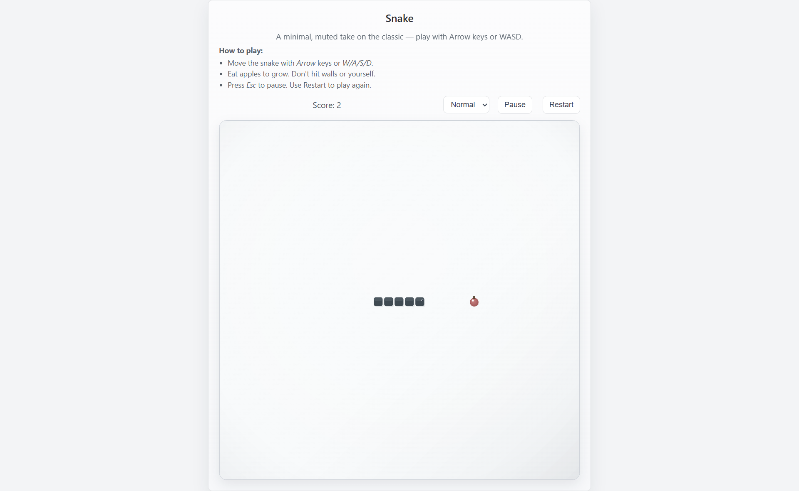
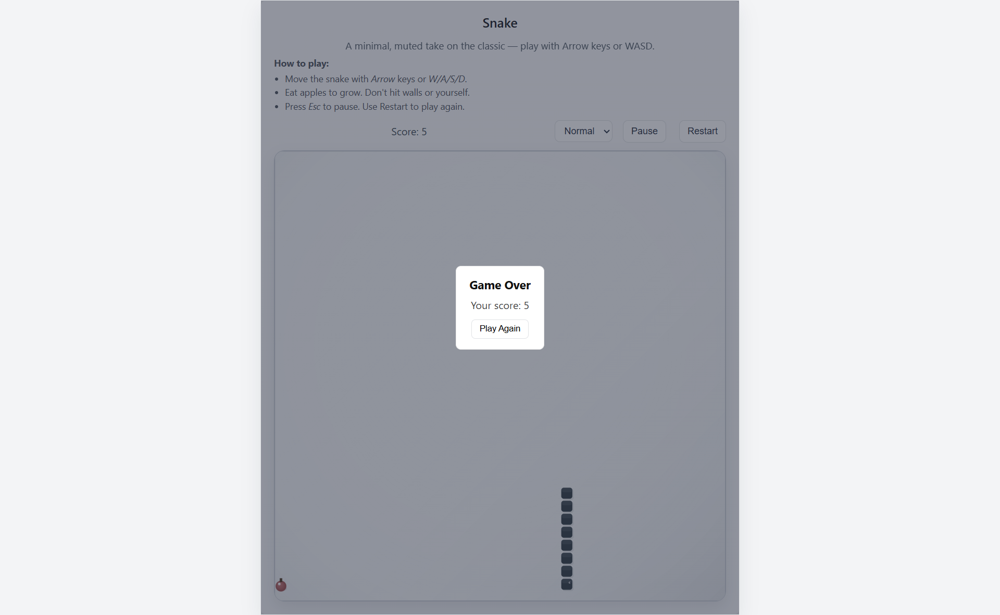

# Snake Game

A compact, minimal Snake game implemented with plain HTML, CSS, and JavaScript. Designed for clarity and easy iteration: playable in the browser, responsive layout, muted visual style, and lightweight assets.

## Demo
Open `index.html` in a browser or serve the folder with a simple static server (recommended):

```bash
# from this project folder
python -m http.server 8000
# then open http://localhost:8000/
```

Notes: Some browsers block audio until the page receives a user gesture; press a key or click before sounds will play.

## Screenshot



## Features
- Playable Snake: keyboard controls (Arrow keys and WASD)
- Smooth movement with frame interpolation
- Apple spawning, scoring, and growth on eating
- Pause (Esc) and Restart controls, game-over overlay
- Muted, minimal visual design with rounded snake segments and shaded apple
- Responsive HUD and canvas for mobile and desktop
- Lightweight sound effects (included in `sound/`)

## Controls
- Move: Arrow keys or W / A / S / D
- Pause / Resume: `Esc` or the Pause button
- Restart: Restart button or "Play Again" on the Game Over overlay

## Project structure
- `index.html` — page markup and HUD
- `style.css` — styles and responsive layout
- `script.js` — game logic, rendering, and input handling
- `sound/` — audio assets (move, food, game over)
- `devlogs/`, `DEVNOTES.md`, `todo.md` — development notes and TODOs

## Development notes
- To run locally, use a static server (see Demo). Opening the file directly may work, but some browsers limit features for file:// pages.
- For iterative development, edit `script.js` and `style.css` and reload the page. The game loop uses `requestAnimationFrame` with a fixed-step accumulator for deterministic ticks.
- See `DEVNOTES.md` for manual QA steps and suggested checks before publishing.

## Roadmap / Production checklist
Pending items to finalize for a production release:
- Automated tests for edge cases (fast movement, repeated collisions)
- Cross-browser verification (Chrome, Firefox, Safari, Edge)
- Optional mobile touch controls and improved accessibility
- Bundle/minify for deployment

## Contributing
Contributions and improvements welcome. Open an issue or create a PR. Keep changes focused, and run the manual checks in `DEVNOTES.md` when modifying game logic.

## License
This project is provided as-is. Add a license file if you plan to publish or share the project with specific reuse terms.
